# PROYECTO FINAL DEL MÓDULO "DESARROLLO DE INTERFACES"

Proyecto final del módulo Desarrollo de Interfaces, del I.E.S. Clara del Rey, impartido por Fernando Ureña Lara.

El objetivo es realizar una agenda para guardar contactos con persistencia en una base de datos relacional.

El proyecto ha sido realizado por los alumnos del grupo DM1D1A:

- María Martinez Sanz.

- Victor López Lozano.

- Gabriel Maillo Sevilla.

  <br/><br/>
  <br/><br/>

## REQUISITOS

   <br/><br/>

- Java 11 o superior.

- [Eclipse IDE con JavaFX (e(fx)clipse)](https://www.eclipse.org/)

- [JavaFX Scene Builder](https://www.oracle.com/java/technologies/javase/javafxscenebuilder-info.html)

- [MariaDB](https://mariadb.org/)
  
   <br/><br/>
   <br/><br/>

## INSTALACIÓN

   <br/><br/>

Lo primero que debemos hacer es descargar el repositorio desde el enlace de descarga.

Una vez descargado, importamos el proyecto a eclipse. 

En eclipse, observamos en `preferences/JavaFx` que la configuración de SceneBuilder es correcta, comprobando la ruta del ejecutable. De no aparecer, mediante la pestaña Browse le indicamos la ruta.

 <br/><br/>

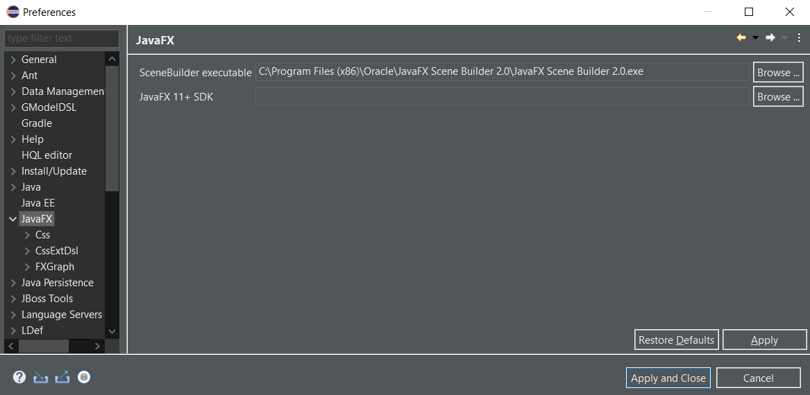
  
 <br/><br/>

De esta manera podemos ejecutar clicando con el boton derecho del ratón `JavaFX Scene Builder` para poder modificar en un entorno gráfico la aplicación.

<br/><br/>

Ahora comprobamos en `preferences/Java/compiler` y en `preferences/Installed` JREs, que tenemos instalada la versión 11 de java o una superior.

<br/><br/>

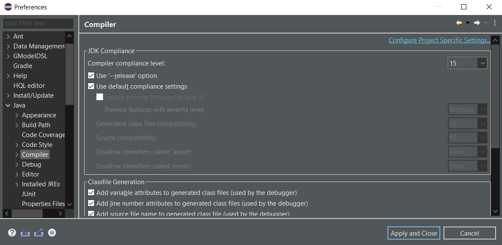

<br/><br/>

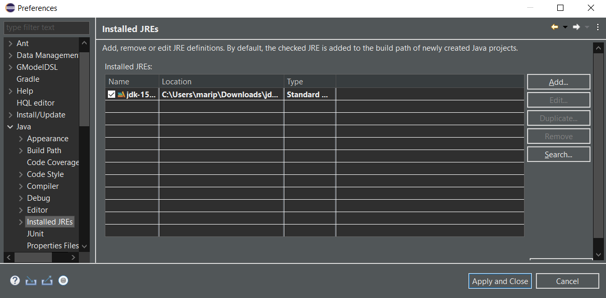

<br/><br/>

Llegado a este punto, accedemos a la carpeta del proyecto [`librerias`](librerias) donde encontraremos dos carpetas con las librerías de JavaFX necesarias para que el proyecto funcione en funcion del sistema operativo que se vaya a utilzar. Escogemos la que corresponda y descomprimimos el archivo comprimido que contiene las librerias.
  
<br/><br/>

Después, clicamos con el botón derecho en la carpeta de nuestro proyecto, y seleccionamos las opciones `Build Path/Configure Build Path/Add External JARs`, seleccionamos todos las librerías que descomprimimos previamente y las añadimos.

<br/><br/>  

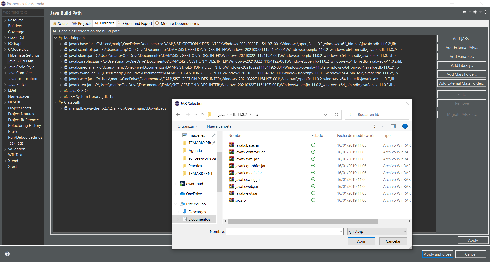
  
<br/><br/>

Añadimos la librería JavaFX SDK de no encontrarse en Java Build Path

<br/><br/>

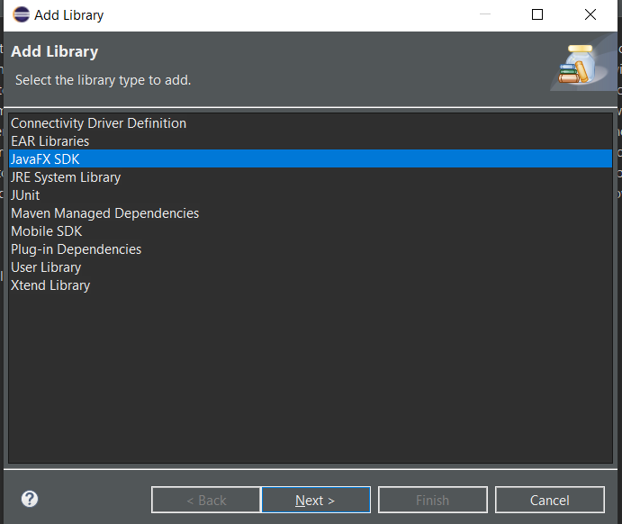
  
<br/><br/>

Por último,  mediante `Add Library/JRE System Library/Installed JREs` seleccionamos Java 11 y aplicamos los cambios. De tener alguna otra versión, la eliminaremos.
  
<br/><br/>

De nuevo en la aplicación, clicamos con el botón derecho del ratón en el MainApp, y seleccionamos `Run As/Run Configurations`.
En la ventana VM arguments, debemos introducir lo siguiente:

```txt
   --module-path "RUTA DE LAS LIBRERÍAS JAVAFX DESCARGADA" --add-modules javafx.controls,javafx.fxml
```

<br/><br/>

Como las rutas varían en funcion del sistema operativo utilizado, lo más sentillo es copiar la ruta directamente de la carpeta `lib` e introducirla después del module path.

<br/><br/>

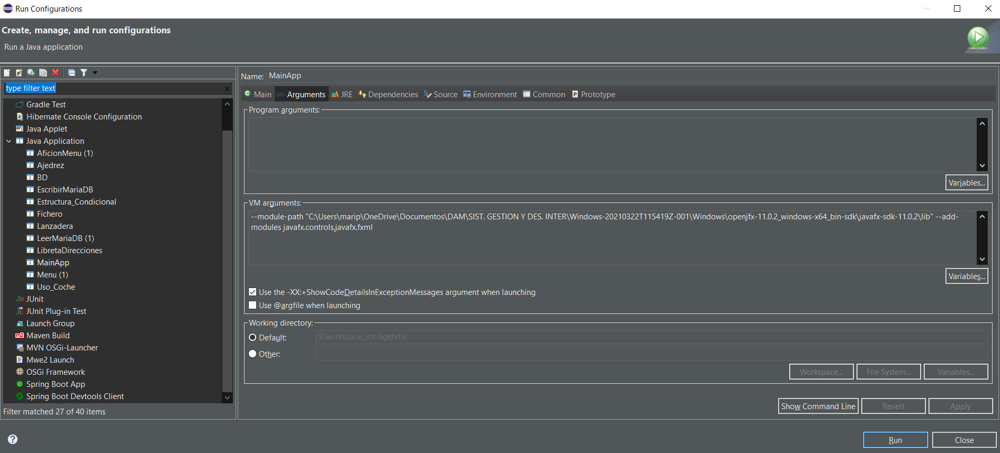

<br/><br/>
<br/><br/>

## INSTALACIÓN Y CONFIGURACIÓN DE LA BASE DE DATOS

<br/><br/>

Ahora vamos a instalar la base de datos `MariaDB`. Pinchando en el nombre en la sección de requisitos, seremos redirigidos a la web oficial para poder descargar el programa. Una vez descargado e instalado, dentro de MariaDB, crearemos un nuevo usuario con privilegios de administrador mediante el comando:

```mysql

GRANT ALL ON *.* TO 'maviga' IDENTIFIED BY '1234' WITH GRANT OPTION;

```

<br/><br/>

Se puede modificar el nombre de usuario y la contraseña, pero es importante recordar que habrá que modificar la parte correspondiente en el `MainApp` para que pueda establecer la conexión correctamente.

<br/><br/>  

Para terminar de configurar la base de datos, mediante este [enlace](https://mariadb.com/downloads/#connectors) podremos descargar el `jdbc (Java Database Connectivity)` necesario para poder conectar la aplicación con la base de datos.

<br/><br/>

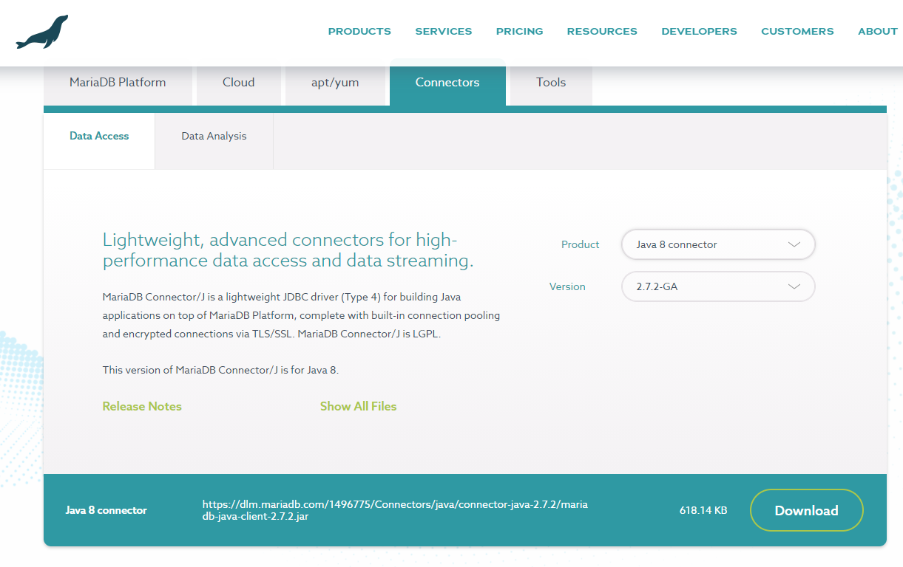
  
<br/><br/>

De la misma manera que hicimos anteriormente, clicamos con el botón derecho del ratón sobre nuestro proyecto y seleccionamos `Build Path/Configure Build Path/Add External JARs` indicandole esta vez el fichero jdbc que acabamos de descargar.
 <br/><br/>
 <br/><br/>
 <br/><br/>

# MANUAL DE USUARIO 📖

<br/><br/>

Si ejecutamos la aplicación, aparecerá la siguiente ventana:
<br/><br/>

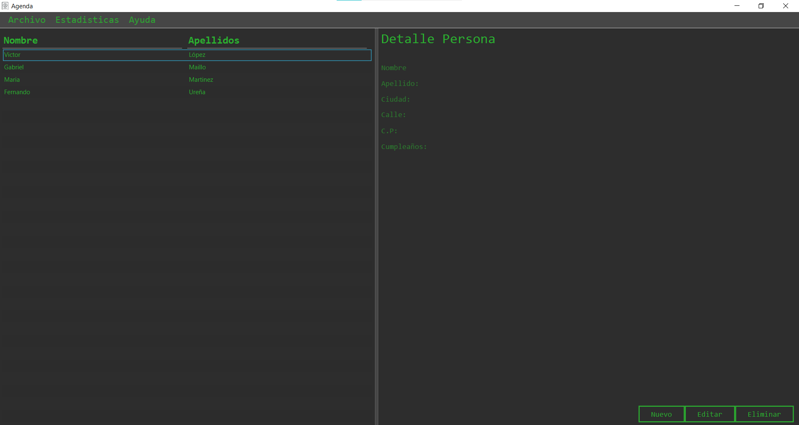

<br/><br/>


Ahora, pasaremos a ver las diferentes funcionalidades de la aplicación.

<br/><br/>

## ALTA DE CONTACTOS

<br/><br/>

Para dar de alta un nuevo contacto, pulsamos en la pestaña `Nuevo` y rellenanmos los campos requeridos.

<br/><br/>

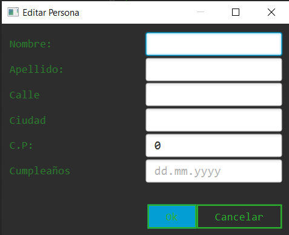
  
<br/><br/>
<br/><br/>    

## MODIFICAR UN CONTACTO

<br/><br/>

Para modificar los datos de un contacto existente, pulsamos sobre el contacto a modificar, y despues clicamos en la pestaña `Editar`.

<br/><br/>

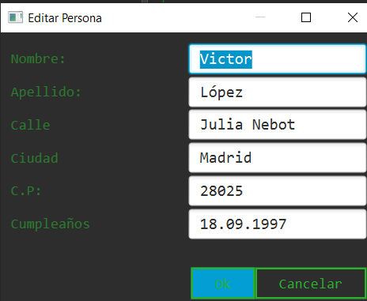
  
<br/><br/>
<br/><br/>    

## BORRAR UN CONTACTO

<br/><br/>

Para eliminar un contacto existente, pulsamos sobre el contacto que queremos eliminar, y despues clicamos en la pestaña `Eliminar`.

<br/><br/>

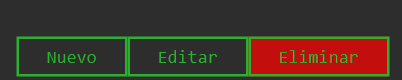
  
<br/><br/>
<br/><br/>    

## ESTADÍSTICAS

<br/><br/>

Para terminar, podemos ver las estadísticas, mediante un gráfico de barras, del número de personas que cumplen años cada mes.

Para ello, pulsamos en la pestaña: `Estadísticas/Ver Estadísticas`. 

<br/><br/>

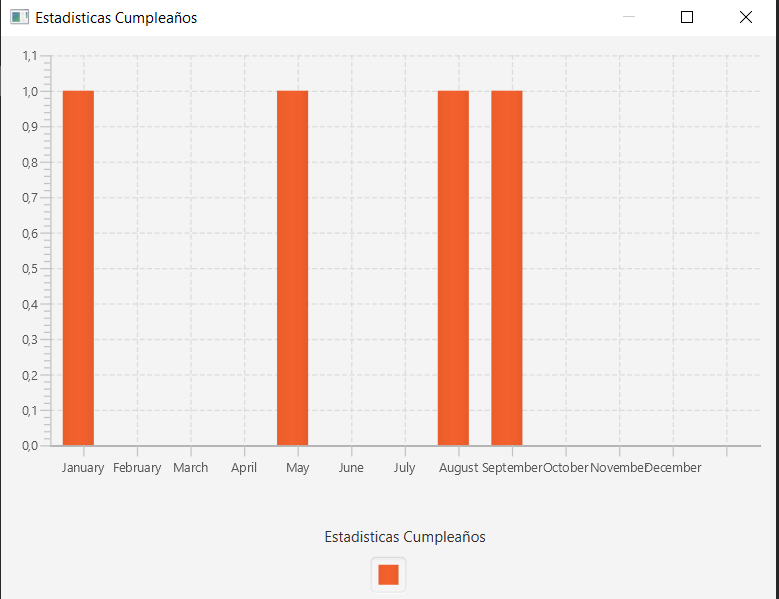

